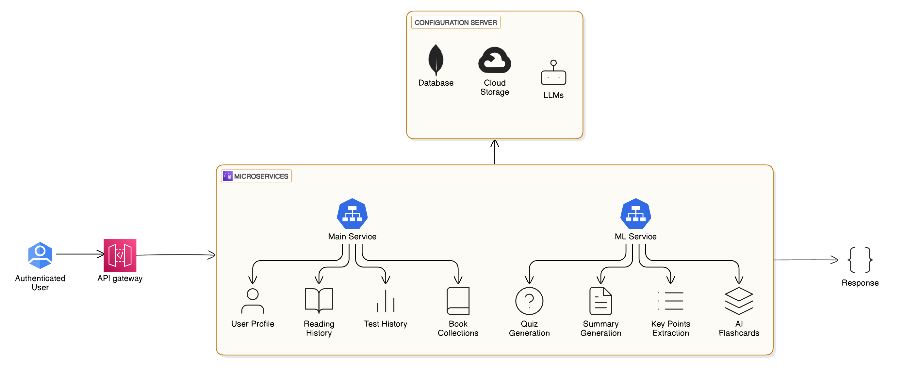

# 📖 AI-Ebook-Reader
🔗 **Live Demo**: [AI-Ebook-Reader](https://ai-ebook-reader.vercel.app/)

AI-Ebook-Reader is an upgraded version of my previous project, [**Online Library**](https://github.com/tranquility404/online-library). This new version removes previous limitations and introduces **AI-powered features** to enhance the reading experience.

> 🆕 **New here? Not a techie?** [Click here](#-ai-ebook-reader-explained-for-non-techies) to skip the jargon and understand this project in a fun way! 😊

## 🚀 What's New?
In the [**Online Library**](https://github.com/tranquility404/online-library), users could only access a **fixed set of books and pre-saved quizzes**. They couldn't upload their own books or generate personalized content.

With **AI-Ebook-Reader**, users can now:  
✅ **Upload their own eBooks** (Currently supports **.epub** format).  
✅ **Track reading progress** and organize book collections.  
✅ **Read & share books** with the community.  
✅ **Use AI-powered features**:
- 📚 **AI Summaries** – Auto-generate book summaries.
- 📝 **Quiz Generation** – Create quizzes based on the book's content.
- 🎴 **Flashcards** – Generate flashcards for better retention.

## 🎥 Demo Video
Watch AI-Ebook-Reader in action! 📚✨

<video controls width="100%">
  <source src="demo/ai-ebook-reader-demo.mp4" type="video/mp4">
  Your browser does not support the video tag.
</video>

## 🛠️ Tech Stack
### **Frontend**
- **React** (UI framework)
- **Zustand** (State management)
- **Chakra UI** (Component library)
- **React Query** (Data fetching & caching)
- **Axios** (HTTP client for API calls)

### **Backend**
- **Spring Boot** (Core backend framework)
- **Spring Security** (Authentication & authorization)
- **FastAPI** (For AI-based features)

### **Authentication**
- **Bcrypt Encoder** (Password hashing)
- **JWT Tokens** (Token-based authentication)

### **Database & Storage**
- **MongoDB** (NoSQL database for storing books, user data, and quizzes)
- **Google Cloud Storage** (Cloud storage for book files)
- **Google Play Books API** (Fetch eBook metadata)

## 📌 Project Structure
I wanted to explore all features of **microservices architecture**, so I initially **mixed multiple components into one** as separate modules. This allows me to easily extract and scale them as independent microservices in the future.

📌 **Frontend only communicates with the Core Service**, which then distributes requests to the appropriate microservices.

### 🔹 Architecture Diagram

## 🏗️ Backend Structure
This project follows a **microservices architecture**, designed for **scalability & modularity**.

### **Microservices Overview**
🔹 **MAIN_SERVICE** (Core Microservice)
- Acts as **API Gateway, Configuration Server, Authentication Service & Service Registry**.
- Handles **database operations, cloud storage, load balancing, and core application logic**.
- Frontend communicates **only with the Core Service**, which forwards requests to the concerned microservices.

🔹 **ML_SERVICE** (AI Features)
- Handles all AI-powered tasks:
    - **Quiz Generation**
    - **Summary Generation**
    - **Flashcard Creation**

**Authorization is handled at the service level** rather than centrally, allowing independent scaling of each microservice.

## 🤝 Contribute & Collaborate
This project is open to improvements and new ideas! If you're passionate about **AI, books, or web development**, feel free to **contribute**. Suggestions, feedback, and pull requests are welcome! 🚀

## 🔮 Future Plans & Features (Currently Building)
🚀 Some upcoming features I'm working on:
- 📚 **Book Collection Management**
- 🎴 **Flashcards**
- 🎨 **Improving Summary Look** (Making it more engaging & easy to memorize)
- 📝 **Test History**
- 🎭 **Website Themes**
- 📂 **Support for More File Formats**
- 💬 **Comments & Review Section**
- 🏆 **Leaderboard**
- 📊 **Reading Dashboard**
- 🤖 **ML-based Book Recommendations**
- ...and many more based on community feedback!

## 📈 Skills I Improved
✅ **Backend Development** (Spring Boot, FastAPI, microservices)  
✅ **OOP & System Design** (Scalable & modular architecture)  
✅ **Cloud Storage & Security** (Google Cloud Storage, JWT, Bcrypt)  
✅ **AI Integration** (NLP-based summary & quiz generation)

---

## 🤓 AI-Ebook-Reader Explained for Non-Techies

### 🛠 What Did I Build?
Imagine a **library** where:  
📚 You can **bring your own books** instead of reading only what's already there.  
📝 The **library staff (AI)** reads the books for you and summarizes them in a fun, easy-to-read way.  
❓ They also **create quizzes and flashcards** to help you remember what you've read.  
📖 You can **track how much you've read**, organize your books into collections, and **even share them with friends**.

Most online libraries work like **vending machines**—you get what’s available, and that’s it.  
This project is more like having your **own personal librarian** who adapts to your needs, helps you understand books better, and makes learning fun!

---

### 🧩 Tech Explained in Simple Terms
If you’re not a programmer, here’s a fun way to understand how everything works:

#### 🍔 Frontend & Backend – The Burger Analogy
The frontend is what you **see**—like the **burger in a fast-food meal**. 🍔  
The backend is all the hidden work—like **the kitchen, chefs, and ingredients** that actually make the burger!

- **Frontend (React, Chakra UI, Zustand, React Query, Axios)** → The burger you enjoy.
- **Backend (Spring Boot, FastAPI, MongoDB, Cloud Storage)** → The kitchen where everything is prepared.

---

#### 🏢 Microservices – The Shopping Mall Analogy
Instead of one big **all-in-one store**, I built a **shopping mall** with different shops, each doing its own job efficiently.

Each service runs independently, meaning if one service has an issue, the rest of the system keeps working fine.

---

### 🏗 The Components of My Microservices System

#### 🏛 Configuration Server – The Rulebook 📜
Every shop (microservice) in the mall follows a **set of rules** to stay organized. The **Configuration Server** makes sure all services follow the same settings.

#### 🚪 API Gateway – The Entrance Gate 🚦
Imagine a mall entrance where security checks who can enter and directs people to the right stores.  
The **API Gateway** does the same—it manages all incoming requests and decides where to send them.

#### 🔐 Authentication Service – The Security Guard 🛂
Ever been to an amusement park where they give you a wristband 🎟 to enter different rides?  
The **Authentication Service** makes sure only registered users get access, using **JWT Tokens** (like digital wristbands).

#### 📦 Core Service – The Main Store 🏬
This is the **heart of the system**, handling things like:
- **Uploading & storing books**
- **Tracking reading progress**
- **Managing book collections**

#### 🧠 ML Service – The Smart AI Assistant 🤖
This is where the **AI magic** happens! The ML service takes care of:
- **Generating summaries**
- **Creating quizzes**
- **Making flashcards**

---

### ☁️ Where Do Books & Data Get Stored?
Instead of keeping books in **a dusty old library**, I store them in **a magical cloud** where they can’t get lost!

- **MongoDB (Database)** → Think of this as a **digital bookshelf** where user data and books are stored.
- **Google Cloud Storage** → This is like an **infinite storage locker** where book files are kept.
- **Google Play Books API** → This acts like a **book detective** 🕵️‍♂️, fetching important details like the title, author, and description.
